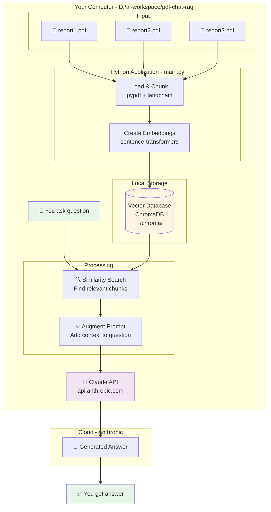
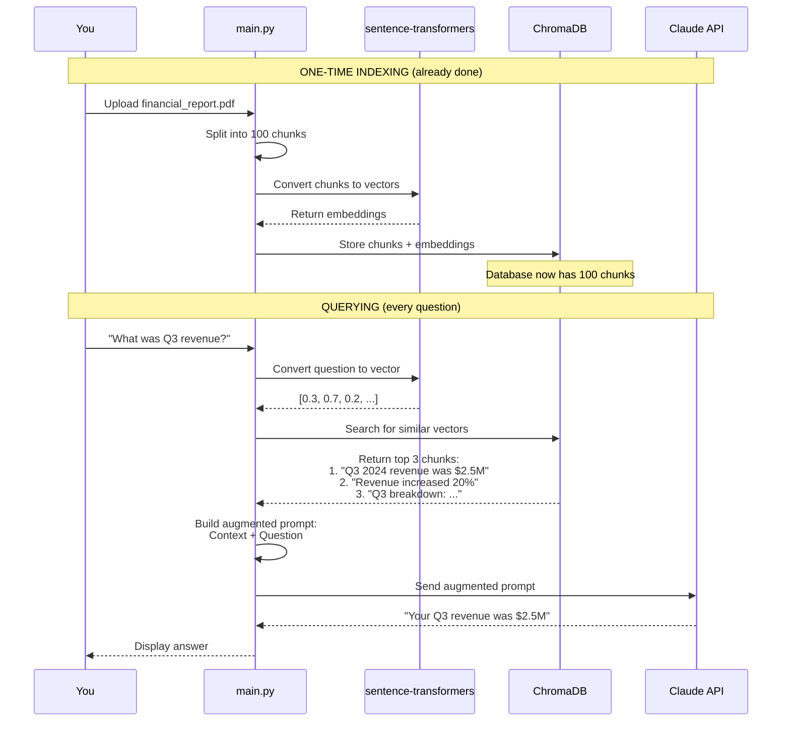

# RAG Architecture Diagram - Chat with PDF Project

## Overview
This diagram shows how our RAG (Retrieval-Augmented Generation) system works in two phases: **Indexing** (one-time setup) and **Querying** (answering questions).

---

## Phase 1: INDEXING (One-time per document)

```mermaid
graph TB
    subgraph "Phase 1: INDEXING - Teaching RAG about your PDFs"
        A[📄 Your PDF File<br/>data/financial_report.pdf] --> B[📖 Load PDF<br/>pypdf library]
        B --> C[📝 Extract Text<br/>'Q3 2024 revenue was $2.5M...<br/>Q4 projections are...']
        C --> D[✂️ Split into Chunks<br/>Chunk 1: 'Q3 2024 revenue...'<br/>Chunk 2: 'Q4 projections...'<br/>Chunk 3: 'Operating expenses...']
        D --> E[🧮 Create Embeddings<br/>sentence-transformers<br/>Chunk 1 → [0.2, 0.8, 0.1, ...]<br/>Chunk 2 → [0.7, 0.3, 0.9, ...]<br/>Chunk 3 → [0.4, 0.6, 0.2, ...]]
        E --> F[(💾 Vector Database<br/>ChromaDB<br/>Stores chunks + embeddings)]
        
        style A fill:#e1f5ff
        style F fill:#fff4e1
    end
```

**What happens:**
1. Load PDF from `data/` folder
2. Extract all text content
3. Split text into ~500 character chunks (with 50 char overlap)
4. Convert each chunk into a vector (list of numbers)
5. Store chunks and vectors in ChromaDB

**You do this ONCE per PDF** (takes ~10 seconds per document)

---

## Phase 2: QUERYING (Every time you ask a question)

```mermaid
graph TB
    subgraph "Phase 2: QUERYING - Asking questions"
        G[👤 You Ask Question<br/>'What was Q3 revenue?'] --> H[🧮 Convert Question to Embedding<br/>sentence-transformers<br/>'What was Q3 revenue?' → [0.3, 0.7, 0.2, ...]]
        H --> I[(💾 Vector Database<br/>ChromaDB<br/>Search for similar vectors)]
        I --> J[🔍 Find Similar Chunks<br/>Compare vectors using math<br/>Find top 3 most similar]
        J --> K[📋 Retrieved Chunks<br/>Chunk 1: 'Q3 2024 revenue was $2.5M'<br/>Chunk 5: 'Revenue increased 20% from Q2'<br/>Chunk 12: 'Q3 sales breakdown...']
        K --> L[✨ Augment Prompt<br/>Build enhanced prompt:<br/>'Context: Q3 2024 revenue was $2.5M...<br/>Question: What was Q3 revenue?<br/>Answer based on context above.']
        L --> M[🤖 Send to Claude API<br/>anthropic library<br/>Claude Sonnet 4]
        M --> N[💬 Claude Generates Answer<br/>'Based on the financial report,<br/>Q3 2024 revenue was $2.5 million']
        N --> O[✅ Return Answer to You]
        
        style G fill:#e8f5e9
        style O fill:#e8f5e9
        style M fill:#f3e5f5
    end
```

**What happens:**
1. Your question gets converted to a vector (embedding)
2. System searches vector database for chunks with similar vectors
3. Finds top 3-5 most relevant chunks
4. Combines chunks with your question (augmentation)
5. Sends augmented prompt to Claude API
6. Claude reads the context and generates answer
7. You get the answer

**This happens EVERY time you ask** (takes ~2 seconds)

---

## Complete System Architecture



---

## Data Flow Example

### Example: "What was Q3 revenue?"

#### Step-by-step breakdown:



---

## File Structure

```
D:/ai-workspace/pdf-chat-rag/
│
├── main.py                 # Main RAG application
├── requirements.txt        # Dependencies
├── .env                    # API keys (ANTHROPIC_API_KEY)
├── README.md              # Documentation
│
├── data/                   # INPUT: Your PDF files
│   ├── financial_report.pdf
│   ├── meeting_notes.pdf
│   └── .gitkeep
│
└── chroma/                # OUTPUT: Vector database (auto-created)
    └── [vector data]      # Stored embeddings + chunks
```

---

## Key Components Explained

### 1. **pypdf** (PDF Loader)
- Reads PDF files
- Extracts text content
- Handles multi-page documents

### 2. **sentence-transformers** (Embeddings)
- Converts text → numbers (vectors)
- Model: `all-MiniLM-L6-v2` (384 dimensions)
- Same model for documents AND questions

### 3. **ChromaDB** (Vector Database)
- Stores text chunks
- Stores vector embeddings
- Fast similarity search
- Runs locally on your computer

### 4. **LangChain** (Orchestration)
- Manages the workflow
- Handles chunking
- Coordinates components
- Makes RAG easier to build

### 5. **Anthropic API** (Generation)
- Claude Sonnet 4 model
- Reads context + question
- Generates natural language answer
- API costs ~$0.003 per query

---

## Vector Similarity Explained

### How does ChromaDB find relevant chunks?

```
Your question: "What was Q3 revenue?"
→ Embedding: [0.3, 0.7, 0.2, 0.8, ...]

Chunks in database:
Chunk 1: "Q3 2024 revenue was $2.5M"
→ Embedding: [0.3, 0.7, 0.2, 0.8, ...]  ← VERY SIMILAR! ✅

Chunk 2: "Operating expenses for office supplies"
→ Embedding: [0.1, 0.2, 0.9, 0.3, ...]  ← NOT SIMILAR ❌

Chunk 3: "Revenue increased 20% from Q2"
→ Embedding: [0.4, 0.6, 0.3, 0.7, ...]  ← SOMEWHAT SIMILAR ✅

ChromaDB uses math (cosine similarity) to find closest matches!
```

### Similarity Math (simplified):

```
Cosine Similarity = How close are two vectors?

Question vector:     [0.3, 0.7, 0.2]
Chunk 1 vector:      [0.3, 0.7, 0.2]
Similarity: 1.0 (perfect match!)

Question vector:     [0.3, 0.7, 0.2]
Chunk 2 vector:      [0.9, 0.1, 0.8]
Similarity: 0.3 (not similar)

ChromaDB returns chunks with highest similarity scores!
```

---

## Performance & Scalability

| Metric | Small Scale | Large Scale |
|--------|-------------|-------------|
| **Documents** | 1-10 PDFs | 1,000-10,000 PDFs |
| **Storage** | ~2 MB | ~2-20 GB |
| **Index time** | 10 sec/PDF | Hours (but one-time) |
| **Query time** | <1 second | 1-2 seconds |
| **Accuracy** | High | High |

---

## Cost Breakdown (per query)

```
1. Load question: FREE (local)
2. Create embedding: FREE (local model)
3. Search ChromaDB: FREE (local)
4. Claude API call: ~$0.003
─────────────────────────────────
Total per query: ~$0.003 (< 1 cent!)

For $5 credit: ~1,600 questions!
```

---

## Next Steps

After understanding this architecture, you'll build:

1. ✅ **Indexing function** - Load PDFs → Embed → Store
2. ✅ **Query function** - Search → Augment → Generate
3. ✅ **CLI interface** - Run from command line
4. ✅ **Test with real PDFs** - Ask questions, get answers!

Then expand to:
- Excel/CSV files (same architecture!)
- Web interface (Streamlit/Flask)
- Multi-user support
- MCP integration (Week 2)

---

## Summary

**RAG in 3 sentences:**
1. **Index once:** Load PDFs → Chunk → Embed → Store in vector DB
2. **Query many times:** Question → Find similar chunks → Augment prompt → Send to Claude
3. **Get answers:** Claude reads context and generates accurate responses based on YOUR documents

**The magic:** Vector similarity search finds relevant information fast, even with millions of documents!
